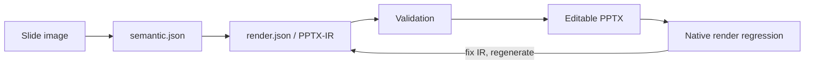

# Image to PPTX-IR

[](LICENSE)
[](https://www.python.org/)

**Turn a slide image into a validated, deterministic plan for an editable PowerPoint rebuild.**

Image to PPTX-IR is an open specification, a zero-dependency validator, an SVG diagnostic previewer, and a ready-to-install Codex Skill. It puts a reproducible intermediate representation between visual understanding and PPTX generation—where geometry, text behavior, arrow direction, dash styles, layers, icon bindings, and container bounds can be tested instead of guessed.

[简体中文](README.zh-CN.md)

## Why an IR?

Direct image-to-PPTX generation is difficult to debug and nearly impossible to reproduce. PPTX-IR makes the hidden decisions explicit:



The result is inspectable, versionable, renderer-independent input—not a one-off file that only looks right on the machine that created it.


The featured example contains **210 editable elements**, 45 resolved Lucide icons, five operating layers, a six-department matrix, nine reusable asset classes, seven operating-mechanism stages, and a continuous improvement loop. The smaller cluster-communication fixture remains available as a quick-start example.

## What is included

- A JSON-based PPTX intermediate representation with nine editable primitives.
- JSON Schemas for semantic and render documents.
- Semantic checks that catch duplicate IDs, unsafe text, broken connector directions, missing icon bindings, and child overflow.
- A deterministic SVG preview for fast structural diagnosis.
- A Codex Skill that teaches the complete reconstruction and regression workflow.
- Bilingual documentation, examples, tests, and a ready-to-enable GitHub Actions workflow.
- No runtime dependencies.

## Quick start

```bash
git clone https://github.com/mapan0424/image-to-pptx-ir.git
cd image-to-pptx-ir
python3 -m pip install -e .

pptx-ir validate examples/ai-operations-system.semantic.json --strict
pptx-ir validate examples/ai-operations-system.render.json --strict
pptx-ir inspect examples/ai-operations-system.render.json
pptx-ir preview examples/ai-operations-system.render.json preview.svg
```

You can also run without installing:

```bash
PYTHONPATH=src python3 -m pptx_ir validate examples/ai-operations-system.render.json --strict
```

## The core model

A render document has a pixel canvas, an explicit layer plan, renderable primitives, and validation rules:

```json
{
  "version": "0.1",
  "canvas": { "width": 1304, "height": 706, "unit": "px" },
  "layerRules": {
    "containerFrames": 10,
    "communicationArrows": 20,
    "texts": 50
  },
  "elements": [
    {
      "id": "send",
      "type": "connector",
      "x1": 548,
      "y1": 186,
      "x2": 604,
      "y2": 186,
      "stroke": "#F04A23",
      "strokeWidth": 1.8,
      "dash": "solid",
      "beginArrow": "none",
      "endArrow": "triangle",
      "direction": "left_to_right",
      "semantic": "send direction",
      "mustNotBeSegmented": true,
      "zIndex": 20
    }
  ],
  "validationRules": ["arrowDirectionMustMatchSource"]
}
```

Allowed primitives are `text`, `rect`, `roundRect`, `line`, `connector`, `path`, `svgIcon`, `image`, and `group`. High-level placeholders such as `card`, `flow`, or generic `icon` are intentionally excluded.

## CLI

### Validate

```bash
pptx-ir validate render.json
pptx-ir validate render.json --strict
pptx-ir validate render.json --json
```

Validation is dependency-free and goes beyond JSON shape. `--strict` treats fidelity warnings as failures, making it suitable for CI.

### Inspect

```bash
pptx-ir inspect render.json
```

Print canvas, element counts, primitive distribution, and layer count.

### Preview

```bash
pptx-ir preview render.json preview.svg
```

The SVG preview is a fast diagnostic—not a substitute for rendering the final deck in Microsoft PowerPoint.

## Use as a Codex Skill

Copy or symlink the bundled skill into your Codex skills directory:

```bash
mkdir -p ~/.codex/skills
cp -R skills/image-to-pptx-ir ~/.codex/skills/
```

Then invoke it with a request such as:

```text
Use $image-to-pptx-ir to convert this slide screenshot into semantic.json and render.json, validate both, and rebuild an editable PPTX.
```

The Skill requires the IR to remain the source of truth through every visual-regression iteration.

## Repository layout

```text
schemas/                    Canonical JSON Schemas
examples/                   Valid semantic and render documents
skills/image-to-pptx-ir/    Installable Codex Skill
src/pptx_ir/                Validator, inspector, and SVG previewer
tests/                      Dependency-free unit and CLI tests
ci/github-actions.yml       Ready-to-enable GitHub Actions workflow
```

To enable GitHub Actions, copy `ci/github-actions.yml` to `.github/workflows/ci.yml` using a GitHub credential with workflow-write permission.

## Scope

This repository defines and validates the representation. It deliberately does not force a single PPTX renderer: Python, PptxGenJS, Office Scripts, or another backend can consume the same IR. Renderer adapters can evolve independently while the source model remains stable.

## Contributing

Issues, renderer adapters, additional visual rules, and real-world examples are welcome. Read [CONTRIBUTING.md](CONTRIBUTING.md) and keep changes reproducible: add a fixture and test whenever you add a rule.

## License

Apache License 2.0. See [LICENSE](LICENSE).
