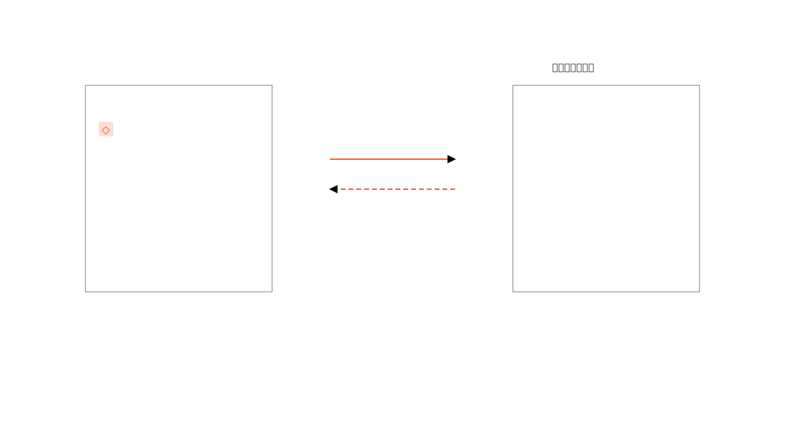

# Image to PPTX-IR

**把一张幻灯片图片，变成可校验、可复现、可生成可编辑 PowerPoint 的确定性方案。**

Image to PPTX-IR 同时是一套开放规范、零依赖校验工具、SVG 结构预览器和可直接安装的 Codex Skill。它在“看懂图片”和“生成 PPTX”之间加入可执行的中间表示，让坐标、文本换行、箭头方向、虚实线、图层、图标绑定和父子边界都能被检查，而不是靠感觉猜。

[English](README.md)

## 为什么需要 IR？

直接从图片生成 PPTX 难以调试，也很难复现。PPTX-IR 把隐含决策全部显式化：

```text
幻灯片图片
  → semantic.json
  → render.json / PPTX-IR
  → 自动校验
  → 可编辑 PPTX
  → PowerPoint 原生渲染回归
  → 修正 IR 后重新生成
```

最终得到的是可阅读、可版本管理、可跨渲染器使用的数据，而不是只能在某台机器上“看起来差不多”的一次性文件。



## 项目能力

- 九种可编辑基础图元组成的 PPTX 中间表示。
- Semantic JSON 与 Render JSON 的正式 Schema。
- 检查重复 ID、文本安全字段、箭头方向、图标绑定和子元素越界。
- 一键生成确定性 SVG 结构预览。
- 完整的图片解析、PPTX 生成和视觉回归 Codex Skill。
- 中英文文档、示例、测试，以及可直接启用的 GitHub Actions 工作流模板。
- 运行时零依赖。

## 快速开始

```bash
git clone https://github.com/mapan0424/image-to-pptx-ir.git
cd image-to-pptx-ir
python3 -m pip install -e .

pptx-ir validate examples/cluster-communication.semantic.json --strict
pptx-ir validate examples/cluster-communication.render.json --strict
pptx-ir inspect examples/cluster-communication.render.json
pptx-ir preview examples/cluster-communication.render.json preview.svg
```

也可以不安装直接运行：

```bash
PYTHONPATH=src python3 -m pptx_ir validate examples/cluster-communication.render.json --strict
```

## 使用 Codex Skill

```bash
mkdir -p ~/.codex/skills
cp -R skills/image-to-pptx-ir ~/.codex/skills/
```

然后这样调用：

```text
使用 $image-to-pptx-ir 把这张幻灯片截图转换为 semantic.json 和 render.json，完成校验，并重建为可编辑 PPTX。
```

Skill 会强制把 Render JSON 作为唯一事实来源：所有视觉修复先回写 IR，再重新生成 PPTX。

## 设计边界

本项目负责定义和校验中间表示，但不强绑某一个 PPTX 渲染器。Python、PptxGenJS、Office Scripts 或其他后端都可以消费同一份 IR。这样渲染器可以独立演进，而源数据保持稳定。

## 参与贡献

欢迎提交真实案例、新的视觉校验规则和渲染器适配。请先阅读 [CONTRIBUTING.md](CONTRIBUTING.md)，新增规则时同时提供测试样例。

## 开源协议

Apache License 2.0，详见 [LICENSE](LICENSE)。
