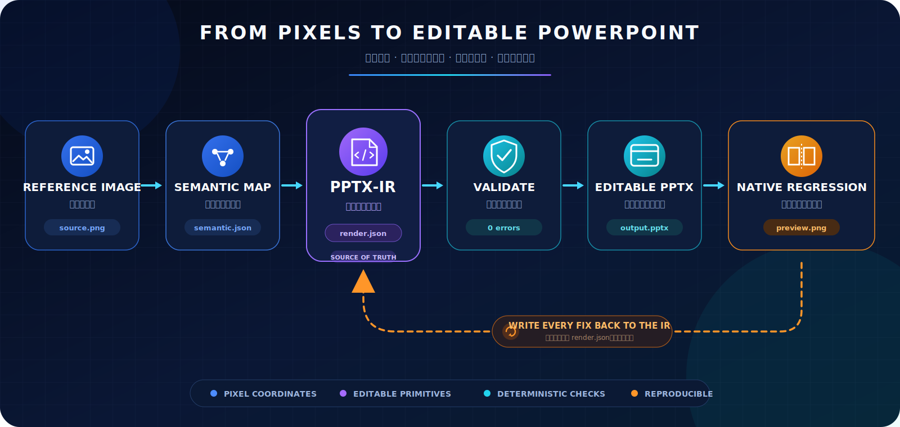
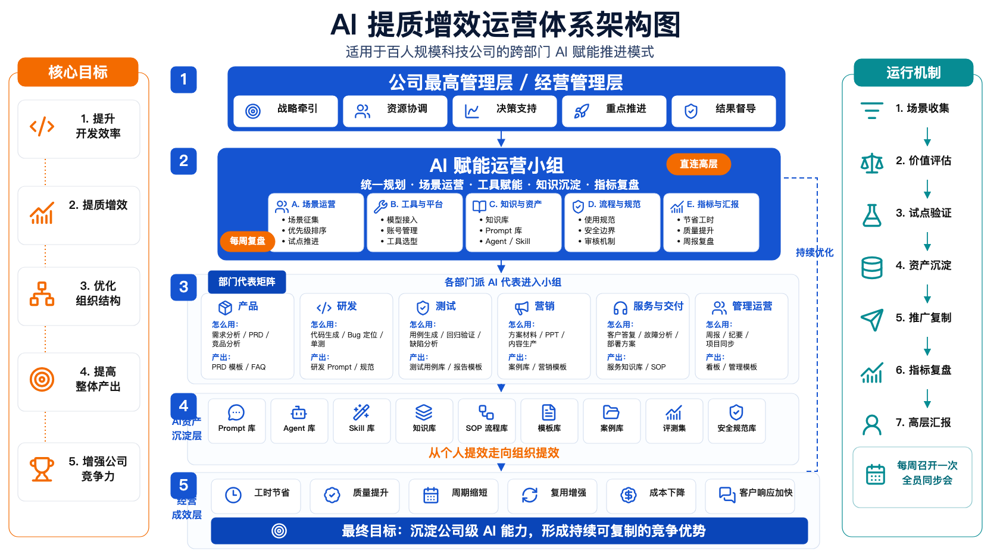

# Image to PPTX-IR

**把一张幻灯片图片，变成可校验、可复现、可生成可编辑 PowerPoint 的确定性方案。**

Image to PPTX-IR 同时是一套开放规范、零依赖校验工具、SVG 结构预览器和可直接安装的 Codex Skill。它在“看懂图片”和“生成 PPTX”之间加入可执行的中间表示，让坐标、文本换行、箭头方向、虚实线、图层、图标绑定和父子边界都能被检查，而不是靠感觉猜。

[English](README.md)

## 为什么需要 IR？

直接从图片生成 PPTX 难以调试，也很难复现。PPTX-IR 把隐含决策全部显式化：



最终得到的是可阅读、可版本管理、可跨渲染器使用的数据，而不是只能在某台机器上“看起来差不多”的一次性文件。



主案例包含 **210 个可编辑元素**、45 个真实 Lucide 图标、五层运营体系、六部门矩阵、九类复用资产、七步运行机制与持续优化闭环。原来的集群通信案例继续保留，作为快速入门样例。

**完整证据链：** [输入图片](examples/ai-operations-system.reference.png) → [语义 JSON](examples/ai-operations-system.semantic.json) → [渲染 JSON](examples/ai-operations-system.render.json) → [可编辑 PowerPoint](examples/ai-operations-system.editable.pptx) → [诊断 SVG](examples/ai-operations-system.preview.svg)

## 项目能力

- 九种可编辑基础图元组成的 PPTX 中间表示。
- Semantic JSON 与 Render JSON 的正式 Schema。
- 检查重复 ID、文本安全字段、箭头方向、图标绑定和子元素越界。
- 一键生成确定性 SVG 结构预览。
- 完整的 Codex Skill 包：包含图片解析工作流、可复用提示词、Schema 模板、视觉检查清单和复杂图标素材规则。
- 中英文文档、示例、测试，以及可直接启用的 GitHub Actions 工作流模板。
- 运行时零依赖。

## 推荐运行配置

- **模型：** Codex GPT-5.5
- **思考强度：** 中度（Medium）

该配置适合执行完整链路：视觉拆解、语义建模、PPTX-IR 编写、可编辑 PowerPoint 生成和渲染回归修正。遇到极高密度页面或复杂保真问题时，可提高思考强度。

## 快速开始

```bash
git clone https://github.com/mapan0424/image-to-pptx-ir.git
cd image-to-pptx-ir
python3 -m pip install -e .

pptx-ir validate examples/ai-operations-system.semantic.json --strict
pptx-ir validate examples/ai-operations-system.render.json --strict
pptx-ir inspect examples/ai-operations-system.render.json
pptx-ir preview examples/ai-operations-system.render.json preview.svg
```

也可以不安装直接运行：

```bash
PYTHONPATH=src python3 -m pptx_ir validate examples/ai-operations-system.render.json --strict
```

## 使用 Codex Skill

```bash
mkdir -p ~/.codex/skills
cp -R skills/image-to-pptx-ir ~/.codex/skills/
```

然后这样调用：

```text
使用 $image-to-pptx-ir 把这张幻灯片截图转换为 semantic.json 和 render.json，完成校验，并重建为可编辑 PPTX。
```

Skill 会强制把 Render JSON 作为唯一事实来源：所有视觉修复先回写 IR，再重新生成 PPTX。

内置 Skill 包包含：

- `SKILL.md`：图片 → semantic.json → render.json → PPTX 的完整操作指南。
- `prompts/`：图片提取 Render JSON、Render JSON 生成 PPTX 的可复用提示词。
- `templates/`：Semantic JSON 和 Render JSON 的任务模板。
- `checklists/`：用于 PowerPoint 原生保真检查的视觉校验清单。
- `references/complex-icon-assets.md`：复杂 AI 图标、3D 图标、渐变发光图标的透明素材保留规则，避免被近似图标库替换。

## 设计边界

本项目负责定义和校验中间表示，但不强绑某一个 PPTX 渲染器。Python、PptxGenJS、Office Scripts 或其他后端都可以消费同一份 IR。这样渲染器可以独立演进，而源数据保持稳定。

## 参与贡献

欢迎提交真实案例、新的视觉校验规则和渲染器适配。请先阅读 [CONTRIBUTING.md](CONTRIBUTING.md)，新增规则时同时提供测试样例。

## 开源协议

Apache License 2.0，详见 [LICENSE](LICENSE)。
